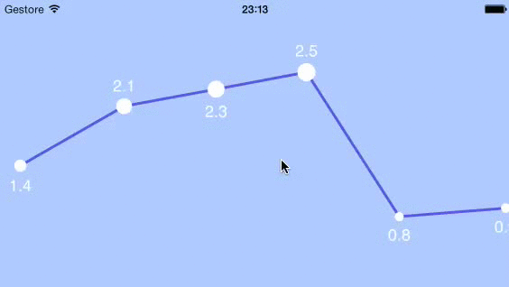

LFLineChartView
===============

A view to show scrollable, highly customizable line charts with parallax effect on iOS.



##Requirements

* Xcode 5 (or higher)
* Apple LLVM compiler
* ARC
* iOS 6.0 (or higher)

##Demo

Build and run `LFLineChartViewExample` project, available in the `Example/Storyboard/` folder.

##Installation

Recommended way to install LFLineChartView is via [CocoaPods](http://cocoapods.org/). Add the following line to your Podfile:

```ruby
pod 'LFLineChartView', '~> 0.1'
```

Install it:

```sh
$ pod install
```

Then open your workspace.

##Usage

To use LFLineChartView you need to inherit from `LFLineChartView`. This component uses datasource & delegate approach to provide content, so you need to implement those two protocols, even in the same inherited class.

_.h_
```objc
@interface LFExampleLineChartView : LFLineChartView <LFLineChartViewDataSource, LFLineChartViewDelegate>

@end
```

_.m_
```objc
- (id)initWithFrame:(CGRect)frame
{
    self = [super initWithFrame:frame];
    if (self)
    {
        self.datasource      = self;
        self.chartDelegate   = self;
        
        // …
    }
    return self;
}
```

###Datasource
Datasource provides content for the chart. Currently, only one set of points is supported.

Lines and dots are rendered using `CAShapeLayer` instances. You can customize them as you want in the `createLayerAtIndex:` and `createLineLayerBetweenIndex:andIndex:` methods, as shown in the example project.

Vertical position (y-axis) is calculated dynamically between maximum and minimum value for `yAtIndex:` for each index. The same happens for size (circle radius) for dots `CAShapeLayer`, using `sizeAtIndex:`.

You can draw horizontal lines across the chart using `createMiddleLineLayerAtIndex:` and related methods.
`yForMiddleLineAtIndex:` use the same value scale of `yAtIndex:`, so displayed height is automagically calculated.

```objc
@protocol LFLineChartViewDataSource <NSObject>

- (NSUInteger) numberOfItemsInLineChartView:(LFLineChartView *)lineChartView;
- (CAShapeLayer *) lineChartView:(LFLineChartView *)lineChartView createLayerAtIndex:(NSUInteger) index;
- (CAShapeLayer *) lineChartView:(LFLineChartView *)lineChartView createLineLayerBetweenIndex:(NSUInteger) firstIndex andIndex:(NSUInteger) secondIndex;

- (CGFloat) yAtIndex:(NSUInteger) index;

@optional
// Size
- (CGFloat) sizeAtIndex:(NSUInteger) index;

// Text
- (NSString *) textAtIndex:(NSUInteger) index;
- (UIColor *) textColor;

// Lines
- (NSUInteger) numberOfMiddleLinesInLineChartView:(LFLineChartView *)lineChartView;
- (CAShapeLayer *) lineChartView:(LFLineChartView *)lineChartView createMiddleLineLayerAtIndex:(NSUInteger)index;
- (CGFloat) yForMiddleLineAtIndex:(NSUInteger) index;

// Empty view
- (UIView *) emptyViewForLineChartView:(LFLineChartView *)lineChartView;

@end
```

###Delegate
Delegate handles events from the chart. Currently, only touch on items is supported.

```objc
@protocol LFLineChartViewDelegate <NSObject>

@optional
- (void) lineChartView:(LFLineChartView *)lineChartView didPressLayerAtIndex:(NSUInteger) index;

@end
```

###Customization
More options are available to customize LFLineChartView. You can set those directly in the `init`/`initWithFrame`/`initWithCoder`/`etc.` method where you instantiate the inherited class.

```objc
@property (assign) CGFloat bounceTolerance;
@property (assign) CGFloat horizontalPadding;
@property (assign) CGFloat verticalPadding;
@property (assign) CGFloat itemSpacing;
@property (assign) CGFloat initialScale;

@property (assign) CGFloat minimumItemRadius;
@property (assign) CGFloat maximumItemRadius;

@property (assign) CGFloat minimumTextHeight;
@property (assign) CGFloat textHeight;
@property (assign) CGFloat textWidth;
```

> You can find more information on how to implement those methods in the **example**.

##Todo

* Support multiple set of points
* Write new examples and a better doc
* Do not use a UIScrollView?

##Contact
Leonardo Ascione

* http://github.com/leonardfactory
* http://twitter.com/leonardfactory
* me@leonardfactory.com


##License
MIT License

Copyright (c) 2013 Leonardo Ascione

Permission is hereby granted, free of charge, to any person
obtaining a copy of this software and associated documentation
files (the "Software"), to deal in the Software without
restriction, including without limitation the rights to use,
copy, modify, merge, publish, distribute, sublicense, and/or sell
copies of the Software, and to permit persons to whom the
Software is furnished to do so, subject to the following
conditions:

The above copyright notice and this permission notice shall be
included in all copies or substantial portions of the Software.

THE SOFTWARE IS PROVIDED "AS IS", WITHOUT WARRANTY OF ANY KIND,
EXPRESS OR IMPLIED, INCLUDING BUT NOT LIMITED TO THE WARRANTIES
OF MERCHANTABILITY, FITNESS FOR A PARTICULAR PURPOSE AND
NONINFRINGEMENT. IN NO EVENT SHALL THE AUTHORS OR COPYRIGHT
HOLDERS BE LIABLE FOR ANY CLAIM, DAMAGES OR OTHER LIABILITY,
WHETHER IN AN ACTION OF CONTRACT, TORT OR OTHERWISE, ARISING
FROM, OUT OF OR IN CONNECTION WITH THE SOFTWARE OR THE USE OR
OTHER DEALINGS IN THE SOFTWARE.


